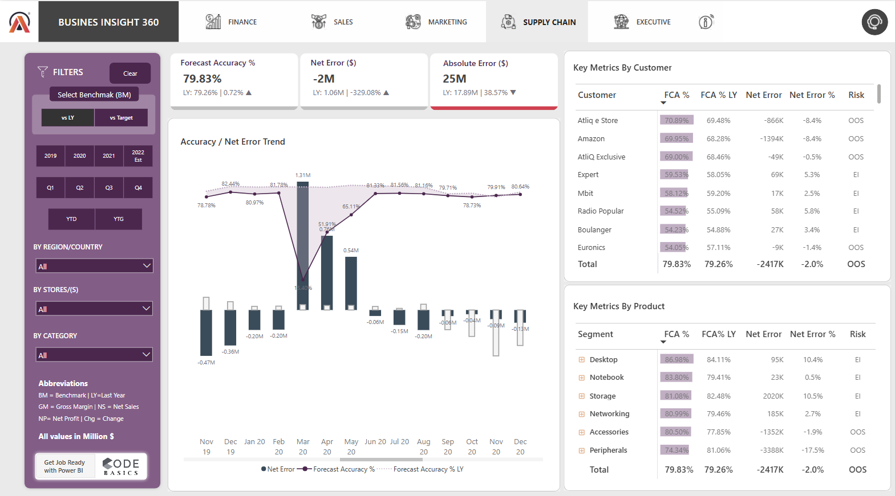

# Business Insight 360 – Power BI Dashboard

## 📌 Project Overview

This project is a comprehensive Power BI dashboard solution for AtliQ Hardware, offering a 360-degree business view across key functional areas: Finance, Sales, Marketing, Supply Chain, and Executive overview. The purpose is to enable **data-driven decision-making** across departments by visualizing performance metrics like Net Sales, Gross Margin, Forecast Accuracy, and Profitability.

This dashboard was developed following a structured business intelligence approach with the help of CodeBasics resources and project guidelines.

---

## 🧰 Tools & Technologies Used

- Power BI Desktop
- Power Query & DAX
- SQL (MySQL)
- Excel
- Power BI Service (for publishing and refresh setup)

---

## 📊 Dashboard Views

### 🏠 Home View

### 💰 Finance View
Profit & Loss statement overview, analyzing Gross Sales, Costs, and Net Profit across regions, products, and time.

### 📈 Sales View
Performance analysis by customer and product on metrics like Net Sales & Gross Margin.

### 📣 Marketing View
Segment-wise profitability and growth with a focus on Net Profit % and GM%.

### 🚚 Supply Chain View
Insight into forecast accuracy, net error trends, and customer/product risk profile.

### 🧠 Executive View
Summarized KPIs for leadership to make strategic decisions.

---

## 🧩 Data Model

The model follows a **snowflake schema** ensuring performance and clarity. Below are the ER diagrams:

---

## 📄 Report PDF

A detailed report of the dashboard is available here: [BI360_Dashboard_Report.pdf](./BI360_Dashboard_Report.pdf)

---

## 🎯 Key Learnings

- Building KPIs and measures using DAX
- Designing intuitive and interactive dashboards
- Using bookmarks and buttons for navigation
- Data modeling and schema optimization
- Applying conditional formatting and KPI indicators
- Automating data refresh using Power BI service

---

## ✅ Outcome

With this dashboard, business users and executives can:
- Monitor sales, profitability, and supply chain KPIs in real-time.
- Analyze performance across regions and customer segments.
- Drive decisions with evidence-based insights.

---

> **Developed by Meet Patel | Guided by CodeBasics Power BI Course**
